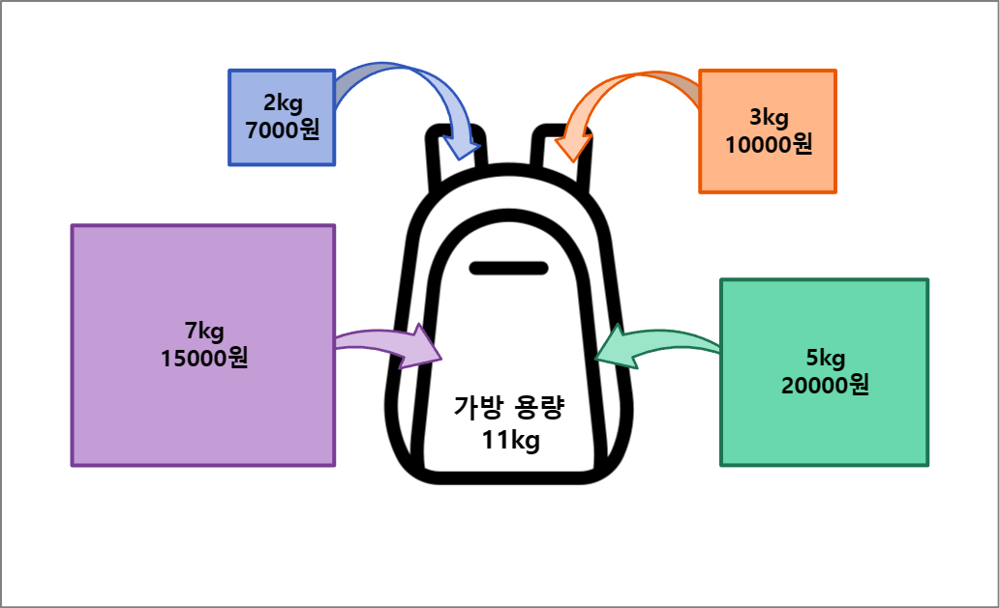
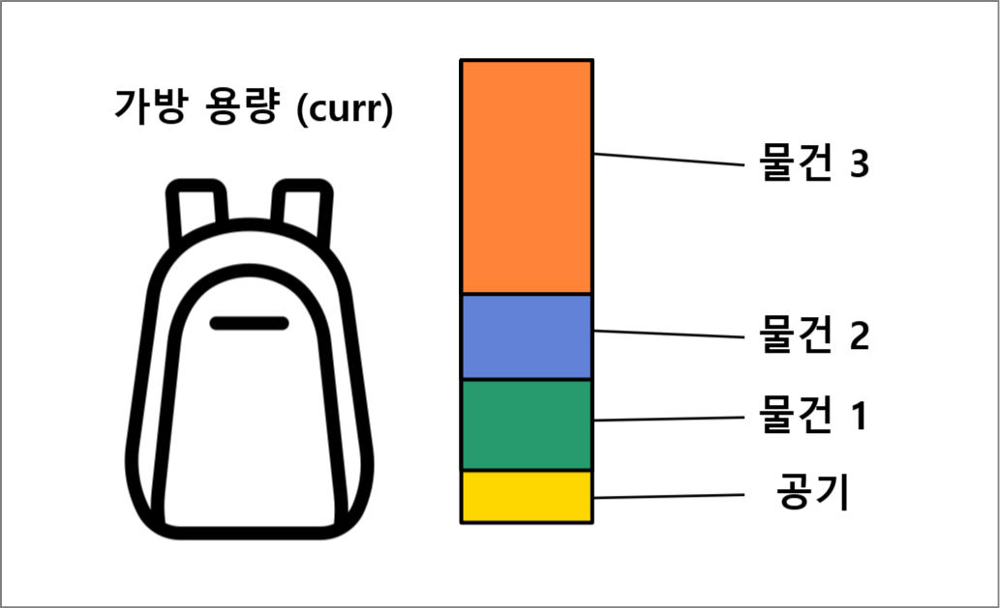
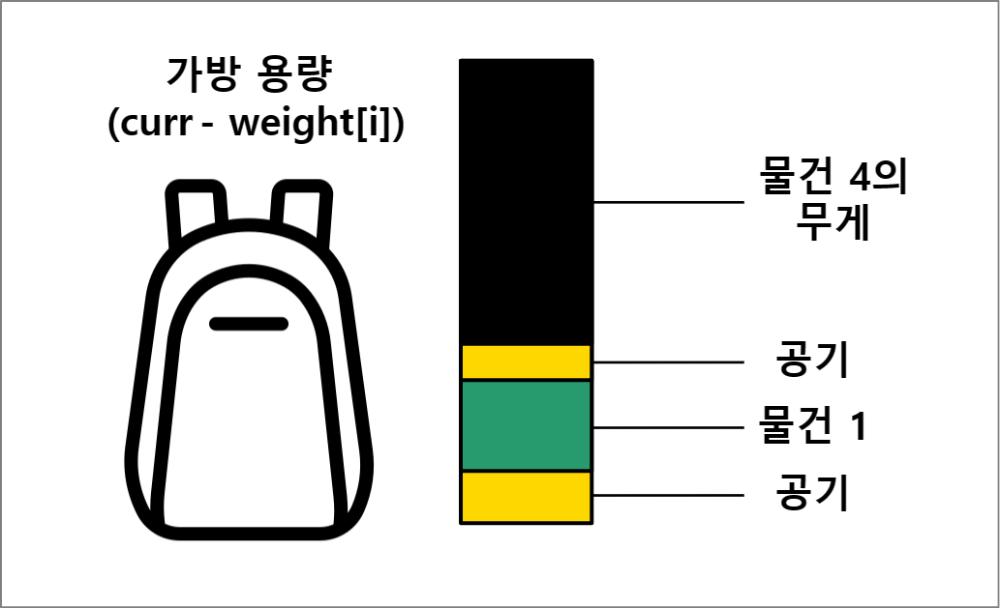
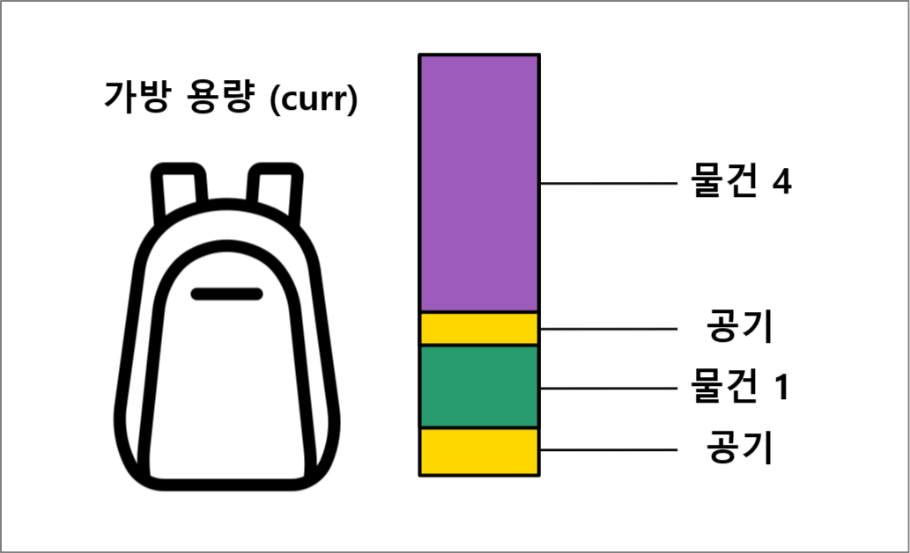

# **배낭 문제(Knapsack Problem)**
{: .no_toc .fs-9 }

<br/>

1. TOC
{:toc}

---

## 배낭 문제란?
{: .fw-700 }

<div class="code-example" markdown="1">
**배낭 문제**는 각 요소들의 비용과 그 가치가 주어질 때, 임의로 정한 비용을 초과하지 않는 범위 내에서 가치의 합이 최대가 되도록 선택하는 조합을 찾는 문제이다.
간단하게 말하면, 내가 현재 가지고 있는 배낭에 최대로 담을 수 있는 무게가 정해져 있고 배낭에 넣을 짐들의 무게와 가치를 알고 있을 때,
가치의 합이 최댓값이 되도록 짐을 고르는 방법을 찾는 문제이다.


{: .image .mx-4 .mt-2 }

배낭 문제는 물건을 나누어 담을 수 있는가와 나누어 담을 수 없는가에 따라 풀이 방식이 나뉘게 된다.
이러한 문제 유형을 각각 [분할 가능 배낭 문제](#분할-가능-배낭-문제)와 [0-1 배낭 문제](#0-1-배낭-문제)이라고 부른다.
</div>

## 분할 가능 배낭 문제
{: .fw-700 }

<div class="code-example" markdown="1">
만약 물건을 나누어 담을 수 있다면, 각 물건의 무게 대비 가치가 높은 순서대로 물건을 넣으면 된다.
때문에 현재 무게 대비 가치가 높은 순서만 고려하면 되므로, 이 문제는 그리디 알고리즘으로 풀 수 있다.

### 코드 해설

```cpp
int n; // n : 물건의 수
float w; // w : 가방의 최대 용량
float weight[n]; // 각 물건의 무게
float value[n]; // 각 물건의 가치
pair<float, float> wpv[n]; // 각 물건의 무게 당 가치
float sum; // 가치의 총합

float knapsack() {
    for(int index = 0; index < n; index++)
        wpv[index] = make_pair(weight[index], value[index]);
    sort(wpv, wpv + n, [](auto a, auto b) {
                return a.second / a.first > b.second / b.first;
        });
    for(int index = 0; index < n; index++) {
        if(weight[index] <= w)
            sum += value[n];
        else {
            sum += value[n] / weight[i] * w;
            break;
        }
        w -= weight[i];
    }
    return sum;
}
```
{: .lh-0 .fw-700 .fs-4 }
위 코드를 풀이하자면, wpv에 무게 당 가치의 값을 저장하고 이를 `(가치 / 무게)`에 대한 내림차순으로 정렬한다.
그 후, 무게 대비 가치가 높은 순서대로 현재 용량과 비교를 한다.
만약 현재 용량이 해당 물건의 총 무게보다 클 경우, 해당 물건을 모두 넣는다.
{: .mb-1 }

반대로 현재 용량보다 해당 물건의 총 무게가 더 클 경우, `(가치 / 무게) × 남은 용량`만큼만 더하고 반복문을 탈출한다.
결과적으로 가치가 높은 물건 순으로 넣을 수 있을 때까지 나누어 넣으면, 넣을 수 있는 물건의 가치의 합이 최대가 된다.
{: .mt-1 }

{: .highlight }
물건을 배낭에 나누어 담을 수 있을 경우에는 무게 대비 가치가 가장 높은 물건들만 고려하면 되는 그리디 알고리즘이 적합하다.
</div>

## 0-1 배낭 문제
{: .fw-700 }

<div class="code-example" markdown="1">
하나의 물건을 나누어 담을 수 없는 경우, 특정 물건들에 대해 각 물건을 넣는 경우와 넣지 않는 경우 중 가치가 최대가 되는 경우를 선택하는 것으로 해결할 수 있다.

수식으로 나타내자면,
{: .pl-3 .d-inline .v-align-middle }
무게
{: .d-inline .v-align-middle }

{: .d-inline .v-align-middle }
와 가치
{: .d-inline .v-align-middle }

{: .d-inline .v-align-middle }
인 각 물건들을 담을 가방의 용량을
{: .d-inline .v-align-middle }

{: .d-inline .v-align-middle }
라고 할 때, 각 물건들에 대한
{: .d-inline .v-align-middle .mr-1 }

{: .d-inline .v-align-middle }
와
{: .d-inline .v-align-middle }

{: .d-inline .v-align-middle }
을 만족하는 집합들 중
{: .d-inline .v-align-middle }

{: .d-inline .v-align-middle }
가 최대가 되는 집합을 찾는 것이다.
{: .d-inline .v-align-middle }

각 물건을 넣는 경우와 넣지 않는 모든 경우에 대해서 탐색을 해야하기 때문에, 다이나믹 프로그래밍이나 백트래킹 등의 풀이를 사용해야 한다.

### 코드 해설

다음은 메모이제이션과 다이나믹 프로그래밍을 이용하여 C++로 임시 구현한 코드는 다음과 같다.
```cpp
int n; // n : 물건의 수
int w; // w : 가방의 최대 용량
int weight[n]; // 각 물건의 무게
int value[n]; // 각 물건의 가치
int memo[n][w+1]; // 메모이제이션

int knapsack() {
    for(int index = 0; index < n; index++) {
        for(int curr = 0; curr <= w; curr++) {
            if(curr < weight[index])
                memo[index][curr] = memo[index - 1][curr];
            else
                memo[index][curr] = max(
                    memo[index - 1][curr],
                    memo[index - 1][curr - weight[index]] + value[index]
                );
        }
    }
    return memo[n - 1][w];
}
```
{: .lh-0 .fw-700 .fs-4 }
위 코드에 대해 하나씩 차근히 살펴보자. 위의 다섯 줄은 각각 우리가 문제를 풀 때 필요한 변수들이다.
함수에서 for 반복문 안에 있는 index는 각 물건들의 인덱스를 나타낸 것이다.
이중 for 반복문 안에 있는 curr은 현재 가방에 담긴 용량이 curr 값일 때를 의미한다.
뒤의 if문과 함께 설명하자면, 현재 담긴 용량이 curr이고 현재 담을 물건의 무게가 weight[i]라고 가정해보자.
curr이 현재 담을 수 있는 용량이 아닌 이미 담긴 용량이라는데에 다소 혼란이 있을 수 있으나, 후술할 설명까지 계속 읽어보기 바란다.
만약 현재 담긴 용량보다 물건의 무게가 더 무겁다면, 우리는 해당 물건을 담지 않는 선택지만을 고를 수 있을 것이다.
이 경우에는 현재 용량에서 이전 물건까지의 결과를 가져온다.
만약 현재 담긴 용량이 물건의 무게보다 크다면, 우리는 해당 물건을 담는 선택지도 고려할 수 있게 된다.
이 경우에는 이전 물건까지의 결과 중 현재 물건을 위한 공간을 마련했을 때의 최댓값을 가져와 현재 물건을 넣어 비교하게 된다.

이 과정을 그림과 함께 이해해보자.
만약 다음과 같은 최대 용량이 curr인 가방이 있다고 가정한다면,
우리는 이 가방에 무게를 임의로 정할 수 있는 가치가 0인 공기로 가득 채울 것이다.
때문에 **용량이 curr인 가방은 항상 담긴 용량도 curr이 된다**.
즉, 위 코드에서 가방에 실제로 어떤 물건이 어떤 무게였던 관계없이 항상 현재 가방에 들어있는 무게는 curr이고,
공기의 value는 0이므로 가치의 합은 실제 무게들의 합이라는 것이다.
```cpp
memo[index - 1][curr];
```
{: .mb-0 }

{: .image .mx-4 .mt-2 .mb-6 }
그리고 우리는 이 가방에 물건 4라는 물건을 담으려고 한다.
만약 curr이 물건 4의 무게보다 작다면, 가방의 최대 용량을 초과했기 때문에 안에 있는 물건에 관계없이 물건을 담을 수 없을 것이다.
만약 반대로 curr이 물건 4의 무게보다 크다면, 우리는 가방에 있는 공기를 비롯한 여러 물건들을 꺼내고 물건 4를 넣을 지 고민할 수 있다.
물건 4를 넣기 위해서는 이전에 물건 4를 넣기 전의 최댓값을 가져와야 한다.
```cpp
memo[index - 1][curr - weight[i]];
```
{: .mb-0 }

{: .image .mx-4 .mt-2 .mb-6 }
그리고 여기에 물건 4를 넣었을 때, 그 값이 물건을 빼지 않았을 때의 값보다 큰 지 비교를 하고, 만약 물건 4를 대신 넣었을 값이 크다면 해당 값으로 대체한다.
{: .mb-0 }
```cpp
memo[index - 1][curr - weight[i]] + value[i];
```

{: .image .mx-4 .mt-2 .mb-6 }
물론, 공기나 물건을 다 빼고 물건 4를 넣었을 때, 그 값이 더 작다면 기존의 값을 유지한다.
이 과정을 0에서 실제 최대 용량인 w까지 반복을 하고, n번째 물건까지 모두 확인한 뒤에 용량이 w일 때의 값이 배낭에 담을 수 있는 가치의 합의 최댓값이 된다.

{: .highlight }
물건을 배낭에 나누어 담을 수 없는 경우에는 모든 물건들에 대해 각 물건을 넣을 때와 넣지 않을 때 중 최댓값을 찾아야하므로,
다이나믹 프로그래밍이나 백트래킹 등의 조합 최적화 알고리즘을 사용해야 한다.
</div>