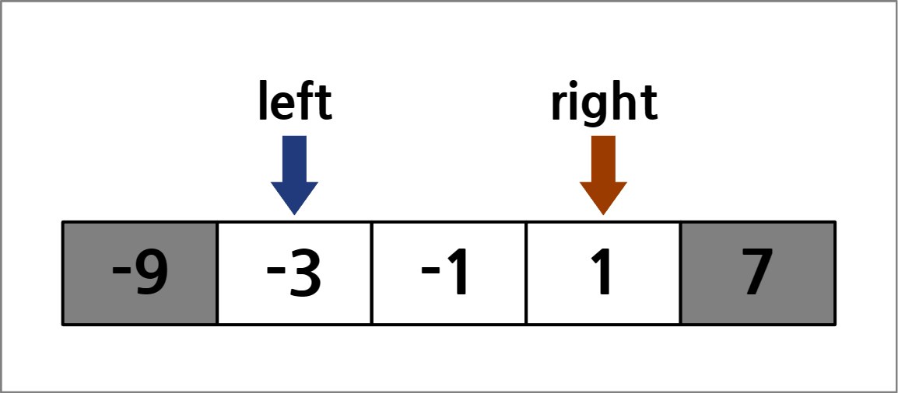
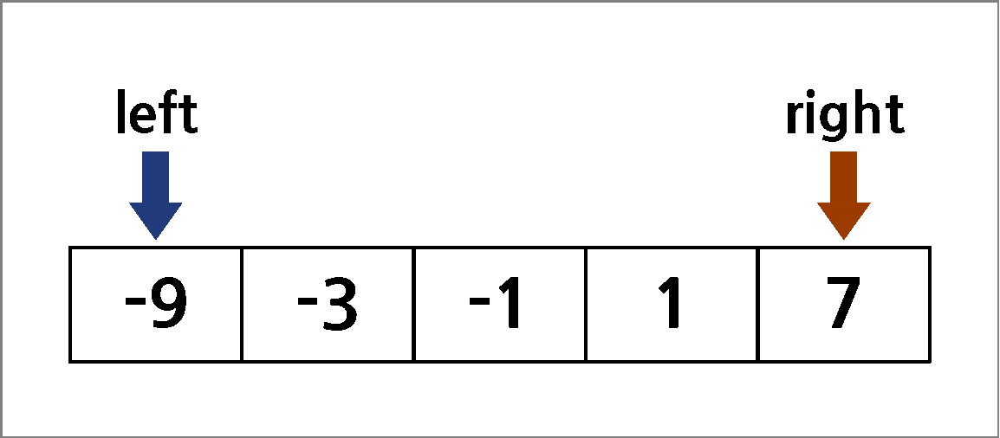

# **두 포인터(Two Pointer)**
{: .no_toc .fs-9 }

<br/>

1. TOC
{:toc}

---

## 두 포인터란?
{: .fw-700 }

<div class="code-example" markdown="1">
두 포인터는 임의의 리스트에 대해 각 인덱스를 가리키는 두 개의 포인터로,
조건을 만족할 때까지 반복하여 포인터를 움직이는 풀이 방식이다.
두 포인터는 알고리즘으로 분류되기 보다는 문제를 해결하는 기술이나 방법에 가깝지만,
문제를 접근하는 데에 도움이 되기 때문에 알고리즘으로 작성하기로 하였다.
{: .mb-1 }


{: .mx-4 .mt-2 }
</div>

### 예제 코드

<div class="code-example" markdown="1">
아래의 코드는 **[백준 2470번: 두 용액](https://www.acmicpc.net/problem/2470)**의 해답 코드이다.
{: .mb-1 }

해당 문제를 간략히 설명하면,
0이 아닌 정수로 이루어진 임의의 리스트의 두 원소의 합이 0에 가장 가까운 원소쌍을 찾는 문제이다.
{: .my-1 }

```cpp
#include <iostream>
#include <algorithm>
#define INF 2 * 1e9 + 1

using namespace std;

// 용액의 개수 (n≡{x:2≤x≤100,000})
int n;
// 용액의 특성값 (arr≡{x:-1e9≤x≤1e9,x≠0})
int arr[100000];

int main() {
    // Fast I/O
    cin.tie(0);
    ios_base::sync_with_stdio(false);

    // 용액의 개수와 그 특성값 입력
    cin >> n;
    for(int i = 0; i < n; i++)
        cin >> arr[i];
    
    // 용액을 오름차순으로 정렬
    sort(arr, arr + n);

    // 용액의 최솟값 비교를 위한 임의의 큰 수 지정
    int min_attr = INF;

    // 결과 출력을 위한 변수
    int min_result, max_result;

    // 두 포인터의 두 인덱스 지정
    int left = 0;
    int right = n - 1;
    // 두 포인터가 만나기 전까지 반복
    while(left < right) {
        // 두 용액의 혼합 특성값의 절댓값
        int attr = abs(arr[left] + arr[right]);
        // 만약 현재 혼합 특성값이 가장 작다면,
        // 최솟값 갱신 및 결과 출력을 위한 값 저장
        if(min_attr > attr) {
            min_attr = attr;
            min_result = arr[left];
            max_result = arr[right];
        }

        // 두 용액의 절댓값 차이가 작아지는 방향으로 포인터 이동
        if(abs(arr[left]) > abs(arr[right]))
            left++;
        else
            right--;
    }

    // 최솟값에 해당하는 두 용액의 특성값 출력
    cout << min_result << ' ' << max_result << endl;
    return 0;
}
```
{: .lh-0 .fw-700 .fs-4 }
코드의 내용을 요약하자면,
주어진 배열을 오름차순으로 정렬하고 두 포인터를 사용해 조건에 맞는 원소쌍을 찾는다.
만약 왼쪽의 포인터가 가리키는 값의 절댓값이 더 크다면 왼쪽의 포인터를 오른쪽으로 움직이고,
반대로 오른쪽의 포인터가 가리키는 값의 절댓값이 더 크다면 오른쪽의 포인터를 왼쪽으로 움직인다.
이 과정을 그림으로 나타내면 다음과 같다.
{: .mb-1 }


{: .mx-4 .my-2 }

음수는 왼쪽에 위치한 값이 오른쪽에 위치한 값보다 절댓값이 크므로 오른쪽으로 움직이고,
양수는 오른쪽에 위치한 값이 왼쪽에 위치한 값보다 절댓값이 크므로 왼쪽으로 움직인다.
두 포인터의 값의 부호가 다를 경우에는 절댓값이 작아져야 두 수의 절댓값 차이도 작아질 수 있으므로,
절댓값이 작아지는 방향으로 이동한다.
{: .mt-1 }

{: .highlight }
이처럼 임의의 두 인덱스나 구간을 지정할 때에 모든 범위를 순회하는 대신
두 개의 포인터로 조건을 만족하는 일부만 확인하는 방식을 **두 포인터**라고 한다.
</div>

## 두 포인터의 특징
{: .fw-700 }

<div class="code-example" markdown="1">
위의 예제 문제를 다시 한 번 예로 들어보자.
위의 문제를 해결하기 위한 방법 중 브루트포스로 접근했다고 가정한다면,
차이가 최소인 두 원소쌍을 찾기 위해 모든 인덱스에 대해 순회해야 할 것이다.
이를 이중 반복문을 통해 구현하면, 최대 연산 횟수는 N(N - 1)이므로 시간 복잡도는 `O(N²)`가 나온다.
{: .mb-1 }

하지만, 위의 방식대로 두 포인터를 사용하여 풀이한다면,
최대 연산 횟수는 왼쪽 포인터와 오른쪽 포인터가 모두 N이므로 시간 복잡도 `O(N)`만에 해결하는 것이 가능하다.
`O(N²)`과 `O(N)`은 리스트의 길이인 N이 커질수록 연산 횟수와 소요 시간은 극명하게 차이가 난다.
즉, 브루트포스 방식을 통한 반복문보다 두 포인터를 사용하는 방식은 **시간 복잡도에 있어 이점을 가진다**.
{: .my-1 }

앞서 말했듯 두 포인터는 문제 풀이에 있어 중요한 시간 복잡도에서 단순 반복보다 큰 우위를 지닌다.
때문에, 임의의 인덱스나 구간을 찾는 문제들을 모두 반복문 대신 두 포인터로 해결하면 된다는 생각이 들 수 있다.
비교를 위해 두 문제를 가져왔다.
{: .my-1 }

* **[백준 1644번: 소수의 연속합](https://www.acmicpc.net/problem/1644)**
* **[백준 1912번: 연속합](https://www.acmicpc.net/problem/1912)**
{: .my-2 }

소수의 연속합(1644번) 문제는 두 포인터를 사용하여 구간의 연속합이 작으면 구간을 늘리고
구간의 연속합이 크면 구간을 줄이는 방식으로 정답을 찾는 두 포인터 문제이다.
하지만, 연속합(1912번) 문제는 조건도 간단하고 난이도도 쉽지만,
두 포인터를 사용하여 풀 수 없는 문제이다.
난이도와 무관하게 두 포인터의 사용 여부를 결정짓는 것은 **탐색 조건**과 **리스트의 규칙성**이다.
앞서 말한 두 포인터의 정의를 다시 한 번 살펴보자.
{: .my-1 }

> **두 포인터는 임의의 리스트에 대해 각 인덱스를 가리키는 두 개의 포인터로,**
> **조건을 만족할 때까지 반복하여 포인터를 움직이는 풀이 방식이다.**
{: .my-2 }

여기서 중요한 것은 만족해야할 **조건**, 그리고 조건을 만족하기 위해 **포인터가 움직이는 방향**인 리스트의 규칙성이다.
소수의 연속합(1644번) 문제는 **연속된 소수의 합으로 만들어야 하는 자연수**라는 조건이 명시되어 있고,
뒤로 갈수록 소수가 증가하는 **오름차순**으로 되어있기에 리스트의 규칙성도 만족하는 상황이다.
때문에, 연속된 소수의 합이 크면 구간을 줄이고, 반대로 크면 구간을 늘리는 과정을 반복하면 해결할 수 있다.
반대로 연속합(1912번) 문제는 **가장 큰 합**이라는 불명확한 조건과
**음수와 양수가 임의로 섞인 리스트**라는 점에서 포인터를 배치하기 모호한 방향으로 인해 반복문을 통해 처리하는 것이 더 적합하다.
{: .my-1 }

다만, 리스트가 정렬되어 있지 않다는 것이 리스트의 규칙성을 만족하지 못한다고 오해해서는 안된다.
그 예시로, **[백준 1806번: 부분합](https://www.acmicpc.net/problem/1806)** 문제가 있다.
문제를 간략히 설명하면, 정렬되지 않은 자연수들로 되어있는 리스트에서 합이 일정 값 이상인 최소 길이의 부분합을 찾는 문제이다.
부분합의 최솟값이라는 조건이 명시되어 있지만, 정렬되어 있지 않아 리스트의 규칙성을 만족하지 못한다고 생각할 수 있다.
하지만, 모든 원소가 자연수라는 점에서 **부분합은 구간이 늘어날수록 반드시 증가하는 방향**이기 떄문에,
부분합의 최솟값을 만족하는 지에 따라 구간을 조절하며 조건을 만족하는 구간의 길이 중 최소 길이를 찾으면 된다.
{: .mt-1 }

{: .highlight }
두 포인터를 사용하면 브루트포스나 단순 반복을 사용하는 것보다 **시간 복잡도에서 이점을 가진다**.
그러나, 두 포인터를 사용하기 위해서는 문제의 **탐색 조건**이 명확해야하며,
포인터가 이동해야할 방향인 **리스트의 규칙성**이 보장되어야 한다.
</div>

## 슬라이딩 윈도우(Sliding Window)
{: .fw-700 }

<div class="code-example" markdown="1">
해당 글을 작성하던 중에 알게된 점이지만, 두 포인터의 종류로 **슬라이딩 윈도우**라는 방식이 있다고 한다.
간단히 설명하면, 구간을 지정하는 두 포인터 중 그 구간을 일정하게 하는 방식를 말한다.
리스트의 길이를 N, 구간을 M이라고 한다면, 반복문으로 작동하면 O(NM)의 시간 복잡도가 나온다.
하지만, 슬라이딩 윈도우를 사용하면 O(N)으로 해결하는 것이 가능하다.
{: .my-1 }

그 예시로 **[백준 21921번: 블로그](https://www.acmicpc.net/problem/21921)** 문제를 들 수 있다.
단순 반복문을 쓰게 되면 최대 `2*1e9`만큼의 연산량이 나와 시간 내에 처리할 수 없다.
슬라이딩 윈도우 방식을 사용하면,
구간을 한 칸 이동할 때마다 앞의 인덱스의 값을 더하고 뒤의 인덱스의 값만 빼주면 되므로 연산량이 크게 줄어든다.
아래는 그 풀이에 대한 코드이다.

```cpp
#include <iostream>

using namespace std;

int main() {
    // Fast I/O
    cin.tie(0);
    ios_base::sync_with_stdio(false);

    // 블로그 총 일 수와 탐색 구간
    int n, x;
    // 블로그 일 별 방문자 수
    int visit[250001];
    // 구간 x에서의 방문자 합
    int x_visit = 0;

    // 블로그 일 수 및 구간 입력
    cin >> n >> x;

    // x일까지의 블로그 방문자 수와 구간 내 방문자 합 저장
    for(int i = 0; i < x; i++) {
        cin >> visit[i];
        x_visit += visit[i];
    }
    
    // 구간 내 최고 방문자 수와 그 구간의 개수 저장
    int max_visit = x_visit;
    int max_count = 1;

    // x일부터 n일까지의 방문자 확인
    for(int i = x; i < n; i++) {
        // 당일 방문자 수 입력
        cin >> visit[i];

        // 구간의 길이를 유지하면서 당일의 방문자 합산
        x_visit += visit[i];
        x_visit -= visit[i - x];

        // 구간 내 방문자 수가 최대일 경우, 일 수나 최댓값을 갱신
        if(max_visit == x_visit)
            max_count++;
        else if(max_visit < x_visit) {
            max_visit = x_visit;
            max_count = 1;
        }
    }

    // 블로그 방문자가 없을 때의 예외 처리
    // 방문자가 있다면 그 최댓값과 일 수를 출력
    if(max_visit == 0)
        cout << "SAD\n";
    else
        cout << max_visit << '\n' << max_count << '\n';
    return 0;
}
```
{: .lh-0 .fw-700 .fs-4 }
</div>