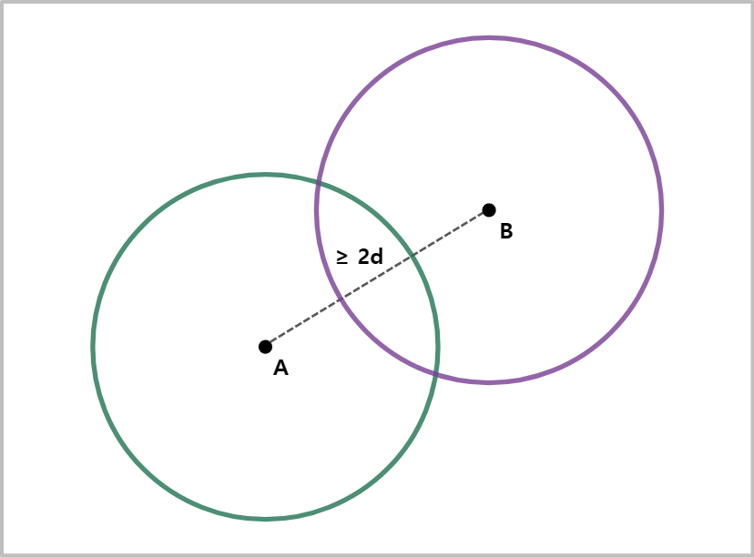







# **{{ title }}**
{: .no_toc .fs-9 }

{{ name }}
{: .fs-4 .d-inline }


{{ page.level }}
{: .label .label-bronze }

{{ page.level }}
{: .label .label-silver }

{{ page.level }}
{: .label .label-gold }

{{ page.level }}
{: .label .label-platinum }


<br/>

1. TOC
{:toc}

---

## 문제 내용
{: .fw-700 }


#### [문제 링크](https://www.acmicpc.net/problem/{{ number }})
{: .no_toc .fs-4 }

## 해결 방안
{: .fw-700 }

<div class="code-example" markdown="1">
좌표 평면 위에서 원점으로 이동하는 최소 시간을 구하는 문제이다.
매초 1만큼 걷는 방법과 한 번에 한 방향으로만 반드시 d만큼 움직일 수 있는 점프를 적절히 섞어 이동할 수 있다.
**걷는 것보다 점프하는 것이 더 빠르다면, 점프를 통해 크게 시간이 단축시킬 수 있으나 점프로 원점을 넘어가면 그만큼 다시 되돌아 와야 한다**.
하지만 원점까지 일직선으로 가는 대신 지그재그로 가는 등의 방식으로 점프 방향을 조정하면, 점프만으로도 충분히 원점에 도달할 수 있다.
이를 위해서는 과연 점프하는 각도나 위치 등을 계산해가면서, 원점에 딱 맞게 도착하는 과정을 어떻게 정할지 고민해봐야 한다.
{: .mb-1 }

다시 생각해보면, 현재 문제 상황은 것은 점프가 시간 단축에 매우 유용하지만, 점프 거리가 정해져 있어 원하는 위치를 넘어가버리는 것이다.
다르게 말하면, d 이내의 거리에서 원점 방향으로 점프를 사용하는 것은 오히려 시간 단축에 불리하다는 것이다.
이를 위해 점프 각도를 조정해 정확하게 원점에 도달하는 방법을 생각해보도록 한다.
**점프만으로 원점에 도착하기 위해서는 최소한 2번의 우회를 위한 점프를 해야 한다**.
이 말은 즉슨, 2×d 이내의 거리의 임의의 두 좌표를 점프 2번으로 오갈 수 있는 지 판단하면 된다는 것이다.
{: .my-1 } 

다음 그림과 함께 살펴보자.

2×d 이내의 거리의 임의의 두 정점이 있다고 할 때, 각 정점에 대해 점프 가능한 거리의 자취를 그리면 원이 되는 것을 알 수 있다.
두 정점에 대해 반지름이 d인 원을 그리면 두 개의 교점이 만들어지는 것을 알 수 있다.
이 정점을 밟고 가면 두 정점을 오가는 것이 가능해진다.
거리가 정확히 2×d인 경우에는, 교점이 단 하나 생기고 그 교점은 점과 점 사이의 최단거리인 일직선 상에 존재한다.
이 것으로 **우리는 2×d 이내의 거리에 있는 두 정점은 반드시 점프 2번으로 도착할 수 있다**는 것을 알게 되었다.
{: .my-1 } 

그렇다면 우리가 목적지에 도달하는 방법은 무엇이 있을까?
결론부터 말하자면, **걷기만 하는 방법, 점프하기만 하는 방법, 걷기와 점프를 적절히 섞는 방법 총 세 가지**가 있다.
만약 점프하는 것보다 걷기다 빠르다면 걷기만 하면 될 것이다.
만약 점프하는 것이 걷는 것보다 빠르다면 뛰는 방법을 우선시 할 수 있는데,
우리가 앞서 확인 했듯이 2×d 이내의 거리라면 점프 두 번만이면 충분하다.
때문에 2×d 이내의 거리까지 최단 거리인 일직선 상으로 점프하여 도착하면,
점프 2번으로 도착할 지와 d만큼 원점으로 점프한 후에 남은 거리는 걸어갈 지를 선택할 수 있다.
이러한 총 세 가지 방법 중 각각에 대해 계산한 뒤 최솟값을 고르면 답이 간단하게 나올 것이다.
{: .mt-1 }
</div>

## 풀이 코드
{: .fw-700 }

```cpp
#include <iostream>
#include <cmath>

using namespace std;

// 세 값 중 최솟값 선택
double Min(double walk, double wnj, double jump) {
    double min_result = walk;
    min_result = min(min_result, wnj);
    min_result = min(min_result, jump);
    return min_result;
}

int main() {
    // 현재 위치 x, y와 점프 거리 d, 점프 시간 t 입력
    long long x, y, d, t;
    cin >> x >> y >> d >> t;

    // 소숫점 12자리로 고정
    cout.precision(12);
    cout << fixed;

    // 현재 위치로부터 원점까지의 거리
    double distance = sqrt(x * x + y * y);
    // 만약 현재 거리가 점프 거리보다 멀다면
    if(distance >= d) {
        // 점프해야 하는 횟수
        long long jump = distance / d;
        // 걷기만 하거나, d 이내의 거리까지 점프하고 나머지는 걷거나,
        // 2×d 이내의 거리에서 두 번 점프하기
        cout << Min(distance, jump * t + (distance - (jump * d)), (jump + 1) * t);
    }
    // 만약 현재 거리가 d 이내라면
    else {
        // 걷기만 하거나, 원점을 넘어 뛰고 걸어서 돌아가거나,
        // 2×d 이내의 거리에서 두 번 점프하기
        cout << Min(distance, t + (d - distance), 2 * t);
    }
    return 0;
}
```
{: .lh-0 .fw-700 .fs-4 }